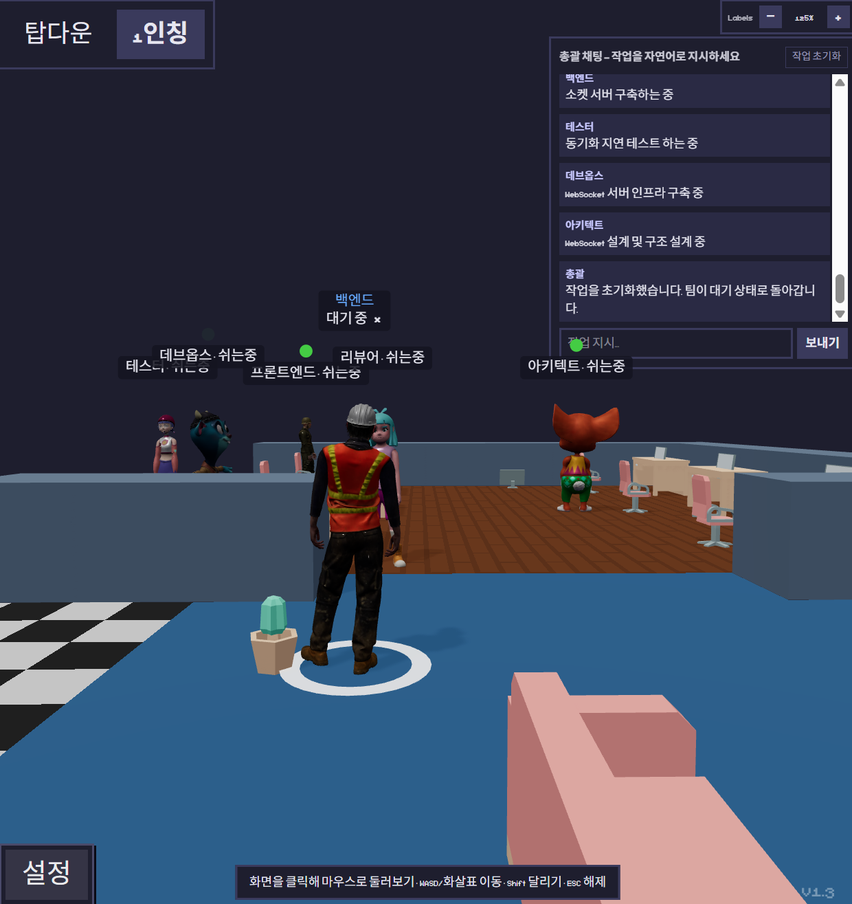

<h1 align="center">Pixel Agents — 라이브 Gemma 오피스</h1>

<h3 align="center">진짜 AI 에이전트 팀이 픽셀 오피스에서 캐릭터로 일하는 모습을, 브라우저에서 실시간으로.</h3>

<p align="center">
  <a href="https://gemma-pixel-office.onrender.com"><b>▶ 라이브 데모 열기 →</b> gemma-pixel-office.onrender.com</a>
</p>

<p align="center">
  <sub>무료 Render 인스턴스라 <b>첫 로딩은 30초 ~ 2분</b> 걸릴 수 있습니다(잠자던 서버를 깨우는 중 — <a href="#첫-로딩이-느린-이유">아래 참고</a>). 이후에는 즉시 뜹니다.</sub>
</p>

<p align="center">
  
</p>

> [pixel-agents](https://github.com/pixel-agents-hq/pixel-agents)를 포크해 **서버에 배포된 자율 멀티 에이전트 오피스**를 올린 버전입니다. 7명의 Gemma 에이전트(총괄 1 + 전문가 6)가 서버에서 돌며 활동을 SSE로 오피스에 실시간 스트리밍하고, 픽셀 스프라이트 대신 3D 캐릭터로도 볼 수 있는 3D 렌더러를 더했습니다. 원본은 "여러 AI 에이전트가 지금 무엇을 하는지"를 걸어다니고 자리에 앉고 타이핑/읽기 애니메이션으로 보여주는 프로젝트이고, 이 포크는 그걸 설치 없이 누구나 위 링크에서 볼 수 있게 만든 것입니다.

## 원본 pixel-agents와 다른 점

|               | 원본 pixel-agents                      | 이 포크 (라이브 Gemma 오피스)                  |
| ------------- | -------------------------------------- | ---------------------------------------------- |
| 실행          | VS Code 확장 / 로컬 CLI, 설치 필요     | 웹에 배포 — 링크만 열면 끝                     |
| 보여주는 대상 | 내 로컬 Claude Code 터미널의 실제 작업 | 서버에서 도는 Gemma 데모 팀 7명                |
| 렌더링        | 2D 픽셀 스프라이트                     | 2D + **3D** (Mixamo, 탑다운 · 1인칭)           |
| 조작          | 관찰 전용                              | **총괄 채팅**으로 자연어 지시 + 진행/완료 보고 |
| LLM 사용      | 없음 (관찰만)                          | Gemma via OpenRouter (서버 측)                 |

## 이 포크가 추가한 것

- **라이브 호스팅 오피스** — 하나의 Node 서비스가 빌드된 오피스를 서빙하면서 _동시에_ 같은 origin에서 실시간 에이전트 이벤트를 스트리밍합니다. URL 하나면 끝, 설치도 설정도 없습니다.
- **진짜 Gemma 에이전트가 구동** — 별도 runner가 OpenRouter로 `google/gemma-4-26b-a4b-it`를 호출해 오피스 이벤트(에이전트 생성, 툴 시작/종료, 대기, 채팅 응답)를 내보냅니다. 오피스 앱 자체는 **LLM을 절대 호출하지 않고** 이벤트만 시각화하므로 runner는 통째로 교체 가능합니다.
- **보고하는 "총괄" 채팅** — 총괄에게 작업을 자연어로 지시하면 팀에 계획·분배하고, 이후 채팅에 실시간 진행 상황(각 에이전트가 지금 무엇을 하는지 역할별로 보고)과 총괄의 최종 완료 보고가 올라온 뒤 팀이 대기로 돌아갑니다. **작업 초기화** 버튼으로 언제든 현재 작업을 멈출 수 있습니다.
- **대기 / 작업 라벨** — 모든 캐릭터에 항상 `이름 · 상태`가 붙습니다: 일하는 중이면 실시간 활동, 노는 중이면 **`쉬는중`** — 누가 누구고 누가 일하는지 한눈에 읽힙니다.
- **3D 오피스 렌더러** — 픽셀 스프라이트에서 3D Mixamo 캐릭터(react-three-fiber)로 토글할 수 있고, 탑다운 조감뷰 또는 1인칭 워크스루(WASD)로 볼 수 있으며, 머리 위 말풍선과 바닥 접지 애니메이션을 갖췄습니다.

## 7명의 에이전트

| 역할                  | 위치              | 하는 일                         |
| --------------------- | ----------------- | ------------------------------- |
| 총괄 (Lead)           | 고정, 상석에 착석 | 계획·분배; 당신의 채팅으로 구동 |
| 아키텍트 (Architect)  | 이동              | 설계 / 구조 작업                |
| 백엔드 (Backend)      | 이동              | 서버 · 데이터 작업              |
| 프론트엔드 (Frontend) | 이동              | UI 작업                         |
| 리뷰어 (Reviewer)     | 이동              | 산출물 리뷰                     |
| 테스터 (Tester)       | 이동              | 검증                            |
| 데브옵스 (DevOps)     | 고정, 착석        | 빌드 / 배포                     |

지시가 없으면 에이전트들은 자리에서 쉬거나 돌아다니고, 총괄이 작업을 분배하면 자리로 걸어가 실행 중인 툴에 맞는 애니메이션을 합니다.

## 첫 로딩이 느린 이유

데모는 Render **무료 플랜**에서 돌고, 무료 플랜은 **약 15분간 트래픽이 없으면 서비스를 잠재웁니다.** 다음 방문 때 Node 프로세스를 다시 깨우고 첫 이벤트를 스트리밍하느라 초기 화면이 대략 **30초 ~ 2분** 걸립니다. 버그가 아니라 무료 플랜의 정상 동작이고, 한 번 깨어나면 다시 잠들기 전까지는 즉시 뜹니다. (Render 플랜을 올리거나 외부 핑거를 붙이면 상시 켜둘 수 있습니다.)

## 라이브 오피스 동작 방식

```
브라우저   ──GET /──────────────►  빌드된 오피스 SPA (dist/webview)
          ◄─SSE /events─────────  실시간 에이전트 이벤트 (same-origin, CORS 없음)
          ──POST /command───────►  총괄 채팅: 총괄에게 작업 지시

서버 (scripts/gemma-agents/runner.mjs, Node 표준 라이브러리만 사용)
    │  SPA 서빙 + 이벤트 스트리밍 + 총괄의 계획·진행·보고 전달
    └──HTTPS──►  OpenRouter  ──►  google/gemma-4-26b-a4b-it
```

핵심 설계:

- **하나의 서비스, 하나의 origin.** runner가 SPA와 `/events` 스트림을 같은 호스트에서 서빙하므로 두 번째 서버도, CORS도 없습니다. `/health`가 헬스체크 엔드포인트입니다.
- **오피스는 API key를 절대 보지 않는다.** `OPENROUTER_API_KEY`는 서버 프로세스에만 존재합니다(Render 시크릿, `sync: false`). 브라우저는 이미 렌더링된 오피스 이벤트만 받습니다.
- **놀 때는 무료.** 에이전트는 작업이 활성일 때만 OpenRouter를 호출하고, 지시가 없으면 "대기" 신호만 브로드캐스트하므로 유휴 상태의 데모는 토큰을 전혀 쓰지 않습니다. 작업은 총괄의 완료 보고(또는 작업 초기화) 뒤 자동 종료되어 비용이 한정됩니다.
- **LLM 비종속.** 오피스는 작고 타입이 정해진 이벤트 스트림만 소비합니다. Gemma runner는 그중 한 producer일 뿐이라, 내장 브라우저 mock이나 다른 드라이버로 UI를 건드리지 않고 교체할 수 있습니다.
- **구조적으로 안전.** 배포된 runner는 시각/활동 드라이버 전용입니다. 셸 명령을 실행할 수 있는 별도의 코드 편집 harness는 공개 배포에 의도적으로 **노출하지 않았습니다.**

## 직접 실행하기

```bash
git clone https://github.com/SJJ-universe/pixel-agents.git
cd pixel-agents
npm install            # npm workspaces가 root + server + webview를 한 번에 설치
```

OpenRouter key를 설정하세요(서버 측 전용 — 절대 커밋 금지):

```bash
export OPENROUTER_API_KEY=sk-or-...        # Windows PowerShell: $env:OPENROUTER_API_KEY="sk-or-..."
```

**배포와 동일하게(라이브 사이트가 돌리는 방식):** 데모 플래그로 오피스를 빌드한 뒤 runner를 띄우고, 출력되는 포트(기본 `7777`)를 엽니다:

```bash
VITE_GEMMA_DEMO=1 npm run build:gemma-demo   # same-origin SSE 브리지가 포함된 SPA 빌드
node scripts/gemma-agents/runner.mjs         # http://127.0.0.1:7777 에서 오피스 + /events 서빙
```

**핫 리로드 개발 모드:** Vite dev 서버와 runner를 함께 띄우고, `http://localhost:5173`을 열어 3D로 토글합니다:

```bash
npm run gemma:dev        # Vite dev 서버 + Gemma runner 병렬 실행
```

runner가 읽는 환경 변수: `OPENROUTER_API_KEY`, `GEMMA_MODEL`(기본 `google/gemma-4-26b-a4b-it`), `AGENTS`(기본 `7`), `PORT`(기본 `7777`), `HOST`(기본 `127.0.0.1`).

## 실제 결과물을 만드는 병렬 에이전트 워크플로우 (`coder.mjs`)

위 라이브 데모와 기본 실행은 **시각화 전용**이라 결과물이 저장되지 않습니다. 실제로 코드를 만들어 **파일로 남기려면** 로컬에서 `coder.mjs`를 돌리세요. 활동 라벨만 내보내는 `runner.mjs`와 달리, 각 Gemma 에이전트에게 **진짜 도구**(`read_file` / `list_dir` / `write_file` / `run_cmd` / `finish`)를 주고 tool-calling 루프를 돌려 실제로 소프트웨어를 만듭니다. 흐름: 총괄이 계획 → 아키텍트 · 백엔드 · 프론트엔드가 서로 다른 파일을 병렬로 구현 → 테스터가 테스트 · 수정 → 총괄이 `SUMMARY.md`를 작성. 같은 오피스 이벤트를 내보내므로 3D 오피스가 **진짜 작업**을 그대로 시각화합니다.

```bash
cp scripts/gemma-agents/.env.example scripts/gemma-agents/.env   # .env 에 OPENROUTER_API_KEY 입력
TASK="만들 것을 한글로 적기" npm run coder:dev                    # runner + 웹뷰; localhost:5173 열고 3D 토글
```

- **계획만 미리보기(쓰기 없음):** `node scripts/gemma-agents/coder.mjs --dry-plan`
- **API 없이 자체검사:** `node scripts/gemma-agents/coder.mjs --selftest`

**결과물이 저장되는 곳:** `WORKSPACE_DIR`(기본 `~/Desktop/gemma-workspace`) — 에이전트가 만든 실제 파일과 `SUMMARY.md`가 여기에 남습니다. 환경 변수로 조절: `TASK`(만들 것), `WORKSPACE_DIR`(작업 폴더), `ALLOW_RUN=0`(셸 실행 끄기 — 읽기/쓰기만), `MAX_STEPS`(기본 14).

**안전:** 모든 파일 조작은 `WORKSPACE_DIR`에 path-jail되고(탈출 거부), `run_cmd`는 타임아웃 + 치명적 명령 deny-list로 보호됩니다. 그래도 모델이 고른 실제 셸을 실행하므로 **버려도 되는 워크스페이스**를 쓰세요. 이 harness는 RCE 위험 때문에 **공개 배포에는 올리지 않았습니다**(라이브 서버에서는 시각화 전용 `runner.mjs`만 돕니다). 경량 Gemma 4는 Claude보다 코딩이 약해 결과가 거칠 수 있습니다. 자세한 내용은 [`scripts/gemma-agents/README.md`](scripts/gemma-agents/README.md).

## 직접 배포하기

이 리포는 [Render Blueprint](render.yaml)를 포함합니다. Render 대시보드에서 **New → Blueprint → 이 리포 선택**. Render가 `render.yaml`을 읽고 시크릿 하나 `OPENROUTER_API_KEY`만 입력받습니다. 빌드는 `VITE_GEMMA_DEMO=1 npm run build:gemma-demo`, 실행은 `node scripts/gemma-agents/runner.mjs`로 이뤄지고, `autoDeploy`가 켜져 있어 연결된 브랜치에 push할 때마다 재배포됩니다.

## 아키텍처 (원본 프로젝트)

엄격하게 계층화된 4-패키지 monorepo입니다(`core`는 아무것에도 의존하지 않고, `server`와 `webview-ui`는 `core`에만 의존, VS Code adapter는 `core` + `server`를 조합):

- **`core/`** — 프로토콜 + 인터페이스. [AsyncAPI 3.0](core/asyncapi.yaml) 계약이 와이어 메시지의 단일 원천이고, TypeScript 바인딩은 여기서 생성되어 CI에서 drift 검사를 받습니다. `HookProvider`(모든 AI 툴의 통합 경계)와 `MessageTransport`를 정의합니다.
- **`server/`** — Fastify HTTP/WebSocket 서버와 공용 `AgentRuntime` + `AgentStateStore`. `npx pixel-agents` standalone CLI도 여기서 나옵니다.
- **`adapters/vscode/`** — VS Code 확장 표면.
- **`webview-ui/`** — React 19 오피스. Canvas 2D 픽셀 렌더러와 react-three-fiber **3D 렌더러**(`webview-ui/src/office3d/`)가 명령형 `OfficeState` 게임 월드를 읽습니다. `createTransport()` 한 곳만이 VS Code(`postMessage`)와 브라우저(`WebSocket`/SSE) 트랜스포트를 분기합니다.

새 AI 툴을 붙이는 건 `server/src/providers/hook/<id>/` 아래 서브디렉터리 하나면 됩니다. 레퍼런스 provider는 Claude Code이고, 이 포크의 Gemma runner는 동일한 오피스 이벤트 형식을 말하는 standalone 드라이버입니다.

## 기술 스택

React 19 · Vite · Canvas 2D · [react-three-fiber](https://github.com/pmndrs/react-three-fiber) + three.js (3D) · Fastify v5 · TypeScript (strict, `erasableSyntaxOnly`) · Vitest + Playwright · Node 표준 라이브러리 runner · OpenRouter (Gemma).

## 크레딧

- **[pixel-agents](https://github.com/pixel-agents-hq/pixel-agents)** ([pablodelucca](https://github.com/sponsors/pablodelucca)) 위에 만들었습니다 — 원본 프로젝트를 응원해 주세요.
- 픽셀 캐릭터는 [JIK-A-4, Metro City](https://jik-a-4.itch.io/metrocity-free-topdown-character-pack) 기반입니다.
- 3D 캐릭터는 [Mixamo](https://www.mixamo.com/) 모델을 GLB로 변환한 것입니다.
- Gemma 모델은 Google, 제공은 [OpenRouter](https://openrouter.ai/).

## 라이선스

MIT — 원본과 동일. [LICENSE](LICENSE) 참고.
